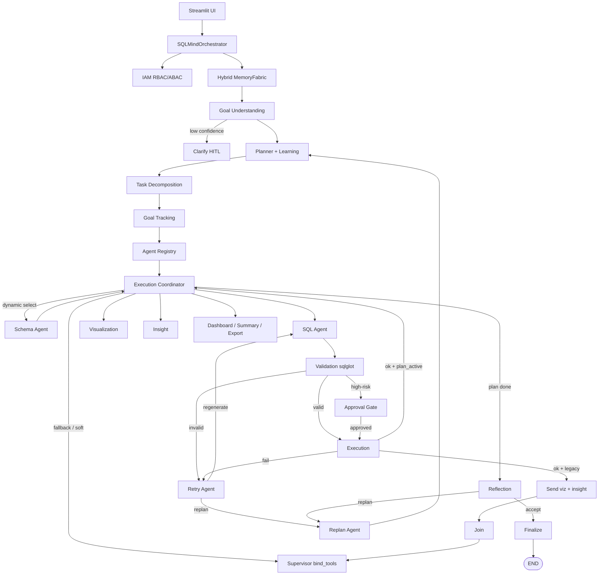

# SQLMind AI — Architecture

Multi-agent SQL analytics on LangGraph + LangChain with real `bind_tools` routing, a deterministic sqlglot security core, an optional goal-driven planner, and an optional enterprise Runtime layer (goal tracking, message bus, plugins, approval gates, vector memory, IAM, reliability, learning).

## Control plane and data plane

| Plane | Responsibility |
|-------|----------------|
| **Control plane** | Memory, Goal Understanding, Planner, Task Decomposition, Goal Tracking, Execution Coordinator, Supervisor routing |
| **Data plane** | Schema Agent, SQL Agent, Validation, Approval, Execution |
| **Analytics plane** | Visualization, Insight, Join, Dashboard, Summary, Optimization, Reflection, Export, Finalize |
| **Platform plane** | Memory Fabric, IAM, Plugin Runtime, queues, circuit breakers, metrics, Runtime Trace |

**GraphState** is the shared typed state across LangGraph nodes (question, schema, SQL, results, plan, messages, progress).

**Agent Message Bus** supports request / reply / broadcast / event messaging between planner and enterprise components.

**Subgraphs** (optional) nest planning, execution, analytics, export, reflection, and recovery when enterprise subgraphs are enabled.

## Packages

| Path | Role |
|------|------|
| `kernel/` | Autonomy Kernel — capability registry, matcher, DI, registry-driven routing |
| `planner/` | Goal Planner — GoalSpec, TaskGraph, AdaptivePlan, Goal Tracking, message bus |
| `governance/` | Approval gates — high-risk SQL / export / connection HITL |
| `plugins/` | Plugin Marketplace — manifest, hot-reload, auto-registration |
| `iam/` | Enterprise IAM — authn/z, RBAC, ABAC, tenants, API keys, audit |
| `memory/` | Conversation, episodic, workflow, vector Memory Fabric |
| `reliability/` | DLQ, circuit breaker, heartbeat, recovery |
| `learning/` | Planner experience store |
| `graph/subgraphs/` | LangGraph subgraphs (planning / execution / analytics / …) |
| `agents/` | AI Agents: Supervisor, specialists, SQL ReAct, Reflection |
| `graph/` | `GraphState`, workflow edges, orchestrator |
| `observability/` | LangSmith, OpenTelemetry, Prometheus, enterprise events |
| `utils/security.py` | Deterministic SQLSecurityGuard |
| `ui/` | Streamlit frontend |

## Autonomy Kernel

Existing AI Agents and tools are registered as discoverable capabilities. The Supervisor binds routing tools from the live `CapabilityRegistry` and resolves tool-calls via the registry — not a handwritten task switch.

Security nodes (`validation_node`, `execution_node`) are cataloged with `ai_routable=False` and remain on fixed graph edges.

## Goal Planner

Goal-driven planning sits in front of the Supervisor when `AUTONOMY_PLANNING_ENABLED` is true (default).

## Enterprise Runtime

Additive, configuration-gated layer: Goal Tracking, Agent Message Bus, Plugin Marketplace, Approval Gates, vector Memory Fabric, IAM, enterprise events, reliability (DLQ / circuit breaker / heartbeat), planner learning, and LangGraph subgraphs.

| API | Role |
|-----|------|
| `GoalTrackingRecord` / `GoalStore` | Goal lifecycle persistence |
| `AgentMessageBus` | Request / Reply / Broadcast / Event |
| `PluginMarketplace` | Dynamic capability discovery |
| `approval_gate` | Human approval HITL |
| `MemoryFabric` | Hybrid vector + workflow + episodic |
| `IAMService` | AuthN/Z, RBAC/ABAC, tenants, API keys |
| `PlannerExperienceStore` | Learn from successful / failed plans |
| `orch.iam` / `orch.plugins` / `orch.memory_fabric` | Exposed on orchestrator |

Distributed workers are an optional **local** SQLite-backed worker pool (`DISTRIBUTED_EXECUTION_ENABLED`), not a remote cluster.

## Observability

| Layer | Behavior |
|-------|----------|
| Correlation | `trace_id` / `span_id` via `observability.tracing` on every run |
| LangSmith | Enabled when `LANGCHAIN_API_KEY` is set |
| OpenTelemetry | Optional (`OTEL_ENABLED=true`) |
| Prometheus | Optional metrics export / HTTP endpoint |
| Enterprise events | Goals, plans, agents, SQL, retries, approvals, plugins, graph transitions |
| Plan trail | `auton_decisions`, `agent_messages`, `execution_progress.timeline` |
| Runtime page | Live AI Agent, parallel, queue, plugin, IAM, and recovery views in Streamlit |

## Security invariant

Every SQL statement passes `SQLSecurityGuard.validate()` before DB I/O. The graph hard-wires `sql_agent → validation_node → [approval_gate?] → execution_node`. The LLM **cannot** skip this gate.

## Memory

| Layer | Implementation |
|-------|----------------|
| Short-term | Conversation buffer |
| Compression | `ConversationSummarizer` + vector `compress_text` |
| Episodic | `EpisodicMemoryStore` |
| Workflow | `WorkflowMemoryStore` |
| Vector | `VectorMemoryStore` + `MemoryFabric` (optional) |
| Learning | `PlannerExperienceStore` |
| Checkpoint | LangGraph Sqlite / MemorySaver |

## Terminology

| Term | Meaning in this project |
|------|-------------------------|
| **AI Agent** | LLM-driven (or registry-listed) specialist node |
| **Deterministic node** | Non-LLM infrastructure step (Validation, Execution, …) |
| **Runtime** | Enterprise execution / telemetry layer and Streamlit Runtime page |
| **Workflow** | One LangGraph run for a user question |
| **Memory** | Conversation + long-term stores + checkpoints |
| **Planning** | Goal → Plan → TaskGraph path |
| **Plugin** | Marketplace skill invoked via Plugin Runtime |

## Related docs

- [Deployment](./DEPLOYMENT.md)
